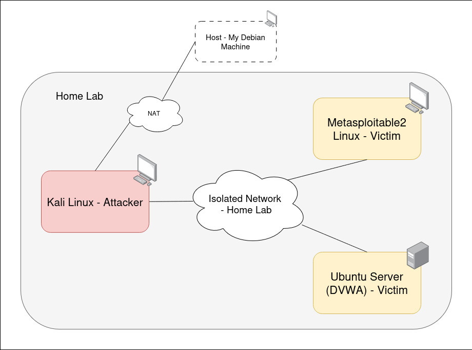

# Home Lab

I have recently started my master's in Computer Science where I am specializing in Cyber Security. In an effort to gain more practical experience in the Cyber Security field, I have decided to start my own Home Lab where I will be doing varioous security related experiments.

## Topology

Currently, my home lab consists of the following:
- A Kali Linux VM: this is what I will be using to conduct the attacks;
- An Ubuntu Server VM hosting a DVWA (Damn Vulnerable Web App) instance: this will be the target of web related attacks.
- A Metasploitable2 VM: this will be used to practice remote exploits, network attacks, and service-level vulnerabilities.
- Isolated Network that connects all of these VMs.

Here is a diagram of the topology:

  

For more details on why I went with this topology, and how I set it up, see [here](01_HomeLab_Setup/README.md). 